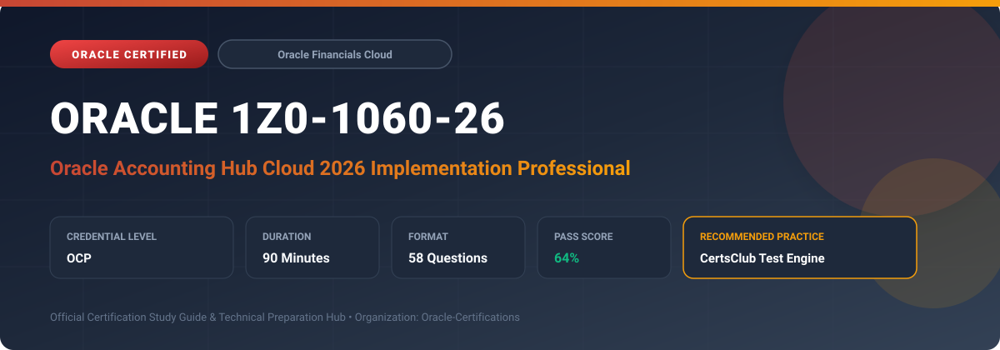

  

# Oracle 1Z0-1060-26: Oracle Accounting Hub Cloud 2026 Implementation Professional

---

## 1. Exam Overview & Candidate Profile

The **Oracle 1Z0-1060-26: Oracle Accounting Hub Cloud 2026 Implementation Professional** examination is designed for cloud professionals, enterprise architects, implementation consultants, and systems administrators who demonstrate deep practical knowledge and operational competence in deploying, configuring, and optimizing Oracle technologies.

The Oracle Accounting Hub Cloud 2026 Implementation Professional (1Z0-1060-26) exam validates implementation skills for the 2026 release of Oracle Accounting Hub Cloud. Candidates demonstrate mastery of modern source system registration, high-throughput automated accounting event processing, multi-ledger and multi-currency subledger rule sets, automated error correction pipelines, and unified analytics integration.

### Target Audience & Prerequisites
- **Target Roles**: Implementation Consultants, Cloud Solution Architects, DevOps/SysOps Engineers, and Enterprise Functional Analysts.
- **Recommended Experience**: 1–2 years of hands-on experience in configuring, administering, or implementing the relevant Oracle solutions.
- **Credential Earned**: Oracle Certified Professional (OCP).

---

## 2. Key Exam Specifications

| Specification | Details |
| :--- | :--- |
| **Exam Code** | **Oracle 1Z0-1060-26** |
| **Official Title** | Oracle Accounting Hub Cloud 2026 Implementation Professional |
| **Certification Track** | Oracle Financials Cloud |
| **Exam Duration** | 90 Minutes |
| **Number of Questions** | 58 Questions |
| **Passing Score** | 64% |
| **Question Format** | Multiple Choice (Single/Multiple Answer), Scenario-Based Questions |
| **Delivery Provider** | Oracle University / Pearson VUE (Online Proctored or Test Center) |
| **Recommended Practice Engine** | [CertsClub Oracle Practice Tests](https://www.certsclub.com/oracle/1z0-1060-26-dumps.html) |

---

## 3. Official Blueprint & Exam Domain Breakdown

The examination assesses candidate competencies across core functional domains weighted as follows:

| Domain Area | Weighting |
| :--- | :--- |
| **2026 Architecture & Source System Integration** | `25%` |
| **Advanced Accounting Transformation Engine & Rules** | `30%` |
| **Subledger Accounting Methods & Multi-Ledger Configurations** | `20%` |
| **Diagnostics, Error Correction, & High-Throughput Ingestion** | `15%` |
| **Reporting, Analytics, & Compliance** | `10%` |

---

## 4. Deep Dive into Complex & Challenging Technical Topics

To secure a passing score on the 1Z0-1060-26 exam, candidates must master the following advanced concepts:

- Implementing automated rule validation and simulation tools to verify accounting transformations before production posting.
- Scaling subledger transaction processing with parallel accounting batches and automated transaction exception workflows.
- Configuring multi-GAAP simultaneous accounting generation for primary, secondary, and reporting ledgers.
- Extracting and auditing detailed accounting entries using Oracle Transactional Business Intelligence (OTBI) and Financial Reporting Center.

---

## 5. Scenario-Based Demo & Practice Questions

### Question 1
In Oracle Accounting Hub Cloud 2026, which component determines the accounting treatment applied to an event class across primary and secondary ledgers?

A) Subledger Accounting Method (SLAM)
B) Chart of Accounts Mapping Structure
C) Journal Category Definition
D) Data Access Set Configuration

- **Correct Answer**: `A) Subledger Accounting Method (SLAM)`
- **Technical Explanation**: The Subledger Accounting Method (SLAM) groups all Journal Entry Rule Sets across subledgers and applies the required accounting rules to primary, secondary, and reporting ledgers associated with accounting events.

---

### Question 2
When high volumes of source transactions fail validation during Create Accounting in Accounting Hub Cloud, what is the best practice to diagnose and correct the errors?

A) Re-upload the source files directly into the GL interface table
B) Enable Accounting Diagnostics and inspect the Subledger Accounting Diagnostic Report
C) Delete the source system registration and re-register
D) Disable validation rules in the General Ledger configuration

- **Correct Answer**: `B) Enable Accounting Diagnostics and inspect the Subledger Accounting Diagnostic Report`
- **Technical Explanation**: Accounting Diagnostics captures source values, rule evaluations, and mapping step executions, outputting detailed reasons why specific transaction lines failed to generate balanced journal entries.

---

## 6. Recommended Preparation Strategy & Practice Testing Engine

Achieving certification in **Oracle 1Z0-1060-26** requires balanced theoretical study and scenario-based simulation practice:

1. **Review Oracle Documentation**: Master architecture guides, implementation workbooks, and administration manuals on the Oracle Help Center.
2. **Hands-on Lab Practice**: Execute real-world configuration, policy setup, and troubleshooting tasks in your cloud tenancy or test instance.
3. **Simulated Exam Drills**: Practice answering timed, scenario-based multiple-choice questions to familiarize yourself with the question formats, traps, and timing constraints.

### Practice With CertsClub
For realistic practice questions, updated dumps, and mock testing environments:
- **Resource**: [CertsClub Oracle Practice Test Engine](https://www.certsclub.com/oracle/1z0-1060-26-dumps.html)
- **Special Discount**: Use coupon code **`club20`** during checkout for an instant **20% discount** on all practice exam bundles and testing engines.

---

## 7. Official Documentation & References

- [Oracle University Certification Registry](https://education.oracle.com/)
- [Oracle Help Center Documentation Portal](https://docs.oracle.com/)
- [Oracle Cloud Infrastructure & Applications Guides](https://docs.oracle.com/en/cloud/)
- [CertsClub Oracle Certification Exam Practice](https://www.certsclub.com/oracle/1z0-1060-26-dumps.html)

---

## 8. SEO & Discovery Keywords

`oracle 1z0-1060-26`, `oracle 1z0-1060-26 exam`, `oracle 1z0-1060-26 dumps`, `1Z0-1060-26 practice questions`, `1Z0-1060-26 study guide`, `oracle 1z0-1060-26 syllabus`, `oracle accounting hub cloud 2026 implementation professional`, `certsclub 1z0-1060-26`